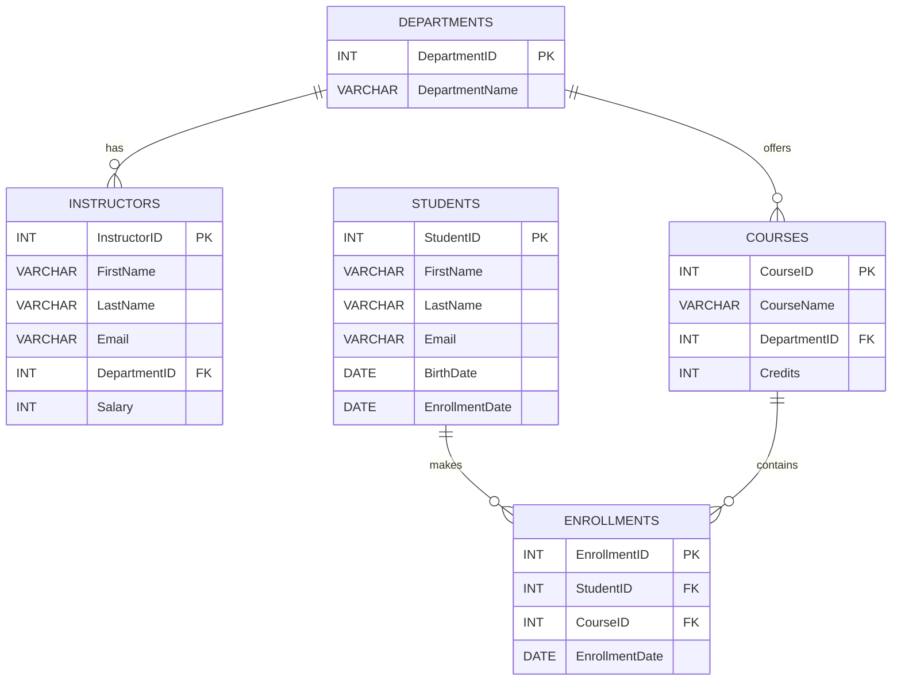
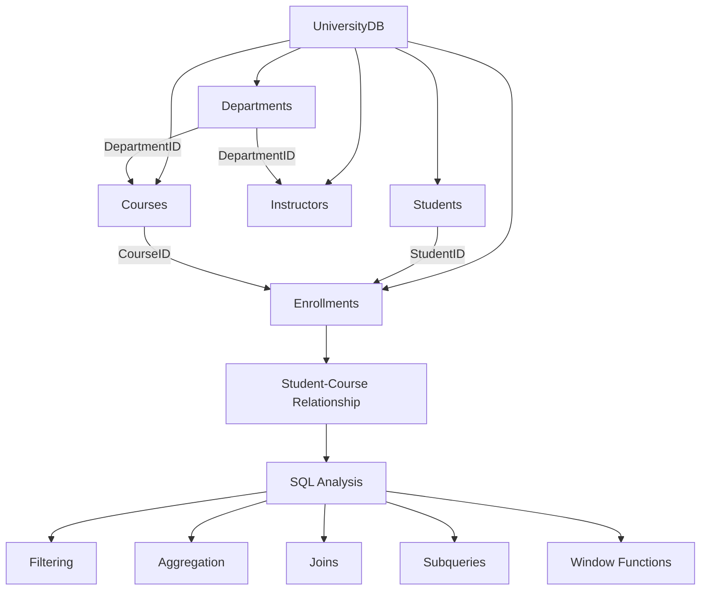

# 🔴 University Database Management System

<p align="center">
  
</p>

<p align="center">
  
</p>

<p align="center">

  

  

  

</p>

---

## 📌 Project Overview

This project is a **University Database Management System** built using **MySQL**.

It demonstrates the design and querying of a relational database containing:

- 👨‍🎓 Students
- 🏢 Departments
- 👨‍🏫 Instructors
- 📚 Courses
- 📝 Enrollments

The SQL project demonstrates database creation, table relationships, data insertion, data manipulation, filtering, aggregation, joins, subqueries, date functions, string functions, conditional expressions, and window functions.

---

## 🎯 Objectives

| # | Objective |
|---|---|
| 1 | Create a structured university database |
| 2 | Store student information |
| 3 | Store instructor information |
| 4 | Store course information |
| 5 | Store student enrollment information |
| 6 | Establish relationships using primary and foreign keys |
| 7 | Perform data insertion, updating and deletion |
| 8 | Filter and analyze database records |
| 9 | Use SQL joins and subqueries |
| 10 | Practice advanced SQL functions |

---

# 🏗️ Database Architecture

The database contains **five main tables**:

| Table | Purpose | Primary Key |
|---|---|---|
| `Departments` | Stores university departments | `DepartmentID` |
| `Students` | Stores student information | `StudentID` |
| `Instructors` | Stores instructor information | `InstructorID` |
| `Courses` | Stores course information | `CourseID` |
| `Enrollments` | Connects students with courses | `EnrollmentID` |

---

## 🔗 Entity Relationship Diagram



---

# 🗂️ Database Structure

## 1️⃣ Departments

```text
Departments
├── DepartmentID       PK
└── DepartmentName
```

The `Departments` table stores the university departments.

### Department Data

| DepartmentID | DepartmentName |
|---:|---|
| 1 | Computer Science |
| 2 | Mathematics |

---

## 2️⃣ Students

```text
Students
├── StudentID          PK
├── FirstName
├── LastName
├── Email
├── BirthDate
└── EnrollmentDate
```

### Student Data

| StudentID | FirstName | LastName | Email | BirthDate | EnrollmentDate |
|---:|---|---|---|---|---|
| 1 | John | Doe | john@email.com | 2000-01-15 | 2022-08-01 |
| 2 | Jane | Smith | jane@email.com | 1999-05-25 | 2021-08-01 |
| 3 | Mike | Brown | mike@email.com | 2001-03-12 | 2023-08-01 |
| 4 | Emily | Davis | emily@email.com | 2000-07-20 | 2022-08-01 |
| 5 | David | Wilson | david@email.com | 1999-11-10 | 2020-08-01 |
| 6 | Sarah | Taylor | sarah@email.com | 2001-09-18 | 2024-08-01 |

### Additional Student

The project also inserts **Alex Patel** later to demonstrate `UPDATE` and `DELETE`.

| StudentID | FirstName | LastName | Email | BirthDate | EnrollmentDate |
|---:|---|---|---|---|---|
| 7 | Alex | Patel | alex@email.com | 2001-01-01 | 2025-08-01 |

---

## 3️⃣ Instructors

```text
Instructors
├── InstructorID      PK
├── FirstName
├── LastName
├── Email
├── DepartmentID      FK
└── Salary
```

### Instructor Data

| InstructorID | Instructor | DepartmentID | Salary |
|---:|---|---:|---:|
| 1 | Alice Johnson | 1 | 75000 |
| 2 | Bob Lee | 2 | 68000 |

---

## 4️⃣ Courses

```text
Courses
├── CourseID          PK
├── CourseName
├── DepartmentID      FK
└── Credits
```

### Course Data

| CourseID | CourseName | DepartmentID | Credits |
|---:|---|---:|---:|
| 101 | Introduction to SQL | 1 | 3 |
| 102 | Data Structures | 2 | 4 |
| 103 | Database Management | 1 | 3 |

---

## 5️⃣ Enrollments

The `Enrollments` table connects students with courses.

```text
Students
    │
    │ StudentID
    ▼
Enrollments
    │
    │ CourseID
    ▼
Courses
```

### Enrollment Data

| EnrollmentID | StudentID | CourseID | EnrollmentDate |
|---:|---:|---:|---|
| 1 | 1 | 101 | 2022-08-01 |
| 2 | 2 | 102 | 2021-08-01 |
| 3 | 3 | 101 | 2023-08-01 |
| 4 | 4 | 101 | 2022-08-01 |
| 5 | 5 | 101 | 2020-08-01 |
| 6 | 6 | 101 | 2024-08-01 |
| 7 | 1 | 102 | 2022-08-01 |
| 8 | 2 | 101 | 2021-08-01 |

---

# 🔑 Keys & Relationships

| Key Type | Table | Column | Purpose |
|---|---|---|---|
| Primary Key | Departments | `DepartmentID` | Uniquely identifies a department |
| Primary Key | Students | `StudentID` | Uniquely identifies a student |
| Primary Key | Instructors | `InstructorID` | Uniquely identifies an instructor |
| Primary Key | Courses | `CourseID` | Uniquely identifies a course |
| Primary Key | Enrollments | `EnrollmentID` | Uniquely identifies an enrollment |
| Foreign Key | Instructors | `DepartmentID` | Links instructors to departments |
| Foreign Key | Courses | `DepartmentID` | Links courses to departments |
| Foreign Key | Enrollments | `StudentID` | Links enrollments to students |
| Foreign Key | Enrollments | `CourseID` | Links enrollments to courses |

---

# ⚙️ SQL Operations Demonstrated

| Category | SQL Concepts |
|---|---|
| Database | `CREATE DATABASE`, `USE` |
| Table Creation | `CREATE TABLE` |
| Data Insertion | `INSERT` |
| Data Modification | `UPDATE` |
| Data Deletion | `DELETE` |
| Data Retrieval | `SELECT` |
| Filtering | `WHERE` |
| Limiting Results | `LIMIT` |
| Aggregation | `COUNT`, `AVG`, `MAX` |
| Grouping | `GROUP BY`, `HAVING` |
| Set Filtering | `IN`, `DISTINCT` |
| Joins | `INNER JOIN`, `LEFT JOIN` |
| Subqueries | Nested `SELECT` |
| Date Functions | `YEAR`, `DATE_SUB`, `CURDATE` |
| String Functions | `CONCAT` |
| Conditional Logic | `CASE` |
| Window Functions | `COUNT() OVER()` |

---

# 🧠 SQL Concepts Overview

```text
                    UNIVERSITY DATABASE
                           │
          ┌────────────────┼────────────────┐
          │                │                │
        TABLES            KEYS            QUERIES
          │                │                │
    ┌─────┼─────┐      ┌───┴───┐       ┌────┴────┐
    │     │     │      │       │       │         │
Students Courses  Primary   Foreign   SELECT    WHERE
Departments       Keys      Keys      JOIN      GROUP BY
Instructors                           HAVING    SUBQUERY
Enrollments                           CASE      FUNCTIONS
```

---

# 🚀 Project Workflow

```text
        ┌─────────────────────┐
        │   Create Database   │
        └──────────┬──────────┘
                   ↓
        ┌─────────────────────┐
        │    Create Tables    │
        └──────────┬──────────┘
                   ↓
        ┌─────────────────────┐
        │ Define Primary Keys │
        └──────────┬──────────┘
                   ↓
        ┌─────────────────────┐
        │ Define Foreign Keys │
        └──────────┬──────────┘
                   ↓
        ┌─────────────────────┐
        │    Insert Data      │
        └──────────┬──────────┘
                   ↓
        ┌─────────────────────┐
        │   Query the Data    │
        └──────────┬──────────┘
                   ↓
        ┌─────────────────────┐
        │ Filter & Group Data │
        └──────────┬──────────┘
                   ↓
        ┌─────────────────────┐
        │   JOIN Operations   │
        └──────────┬──────────┘
                   ↓
        ┌─────────────────────┐
        │ Subqueries & Advanced│
        │       SQL           │
        └─────────────────────┘
```

---

# 📁 Project File

```text
University-Database-SQL/
│
├── 📄 Final project(1).sql
├── 📄 README.md
│
└── 📁 screenshots/
    ├── ss 01(1).png
    ├── ss 03(1).png
    ├── ss 05(1).png
    ├── ss 06(1).png
    ├── ss 07(1).png
    ├── ss 08(1).png
    └── ss 10(1).png
```

---

# 🔎 SQL Query Demonstrations

This section demonstrates the main SQL queries included in the project.

---

## 1️⃣ View All Students

```sql
SELECT * FROM Students;
```

This query retrieves all records from the `Students` table.

### Output

| StudentID | FirstName | LastName | Email | BirthDate | EnrollmentDate |
|---:|---|---|---|---|---|
| 1 | John | Doe | john@email.com | 2000-01-15 | 2022-08-01 |
| 2 | Jane | Smith | jane@email.com | 1999-05-25 | 2021-08-01 |
| 3 | Mike | Brown | mike@email.com | 2001-03-12 | 2023-08-01 |
| 4 | Emily | Davis | emily@email.com | 2000-07-20 | 2022-08-01 |
| 5 | David | Wilson | david@email.com | 1999-11-10 | 2020-08-01 |
| 6 | Sarah | Taylor | sarah@email.com | 2001-09-18 | 2024-08-01 |

---

# 2️⃣ Students Enrolled After 2022

```sql
SELECT * FROM Students
WHERE EnrollmentDate > '2022-12-31';
```

### Purpose

The `WHERE` clause filters students based on their enrollment date.

### Result

| StudentID | FirstName | EnrollmentDate |
|---:|---|---|
| 3 | Mike | 2023-08-01 |
| 6 | Sarah | 2024-08-01 |

---

# 3️⃣ Mathematics Courses

```sql
SELECT CourseName
FROM Courses
WHERE DepartmentID = 2
LIMIT 5;
```

### Purpose

This query retrieves courses belonging to the Mathematics department.

### Result

| CourseName |
|---|
| Data Structures |

---

# 4️⃣ Courses With More Than 5 Students

```sql
SELECT CourseID, COUNT(*) AS Students
FROM Enrollments
GROUP BY CourseID
HAVING COUNT(*) > 5;
```

### SQL Concepts Used

```text
Enrollments
     │
     ▼
 GROUP BY
     │
     ▼
 COUNT(*)
     │
     ▼
 HAVING > 5
     │
     ▼
Filtered Groups
```

The query groups enrollment records by course and uses `HAVING` to filter groups based on the number of students.

---

# 5️⃣ Students Enrolled in Both Courses

```sql
SELECT StudentID
FROM Enrollments
WHERE CourseID IN(101,102)
GROUP BY StudentID
HAVING COUNT(DISTINCT CourseID)=2;
```

### Concepts Used

| SQL Feature | Purpose |
|---|---|
| `IN` | Checks multiple course IDs |
| `GROUP BY` | Groups records by student |
| `DISTINCT` | Avoids duplicate course IDs |
| `HAVING` | Keeps students taking both courses |

### Result

| StudentID |
|---:|
| 1 |
| 2 |

---

# 6️⃣ Students in Either Course

```sql
SELECT DISTINCT StudentID
FROM Enrollments
WHERE CourseID IN(101,102);
```

### Purpose

This query returns students enrolled in either course `101` or course `102`.

The `DISTINCT` keyword prevents duplicate student IDs.

### Result

| StudentID |
|---:|
| 1 |
| 2 |
| 3 |
| 4 |
| 5 |
| 6 |

---

# 7️⃣ Average Course Credits

```sql
SELECT AVG(Credits) AS AverageCredits
FROM Courses;
```

### Result

| AverageCredits |
|---:|
| 3.3333 |

### Concept

`AVG()` calculates the average value of a numeric column.

```text
Credits
   │
   ├── 3
   ├── 4
   └── 3
   │
   ▼
 AVG()
   │
   ▼
3.3333
```

---

# 8️⃣ Maximum Computer Science Salary

```sql
SELECT MAX(Salary) AS MaximumSalary
FROM Instructors
WHERE DepartmentID = 1;
```

### Result

| MaximumSalary |
|---:|
| 75000 |

### Concept

`MAX()` returns the highest value from a column after applying the specified filter.

---

# 9️⃣ Students in Each Department

```sql
SELECT c.DepartmentID,
       COUNT(DISTINCT e.StudentID) AS Students
FROM Courses c
JOIN Enrollments e
ON c.CourseID = e.CourseID
GROUP BY c.DepartmentID;
```

### Query Flow

```text
Courses
   │
   │ CourseID
   ▼
Enrollments
   │
   ▼
COUNT(DISTINCT StudentID)
   │
   ▼
GROUP BY DepartmentID
   │
   ▼
Student Count by Department
```

---

# 🔗 1️⃣0️⃣ INNER JOIN

```sql
SELECT s.FirstName,
       c.CourseName
FROM Students s
JOIN Enrollments e
ON s.StudentID = e.StudentID
JOIN Courses c
ON e.CourseID = c.CourseID;
```

This query combines information from three related tables:

```text
Students
   │
   │ StudentID
   ▼
Enrollments
   │
   │ CourseID
   ▼
Courses
```

### Example Result

| FirstName | CourseName |
|---|---|
| John | Introduction to SQL |
| John | Data Structures |
| Jane | Data Structures |
| Jane | Introduction to SQL |
| Mike | Introduction to SQL |
| Emily | Introduction to SQL |
| David | Introduction to SQL |
| Sarah | Introduction to SQL |

---

# 🔄 1️⃣1️⃣ LEFT JOIN

```sql
SELECT s.FirstName,
       c.CourseName
FROM Students s
LEFT JOIN Enrollments e
ON s.StudentID = e.StudentID
LEFT JOIN Courses c
ON e.CourseID = c.CourseID;
```

### How LEFT JOIN Works

```text
             Students
                │
        ┌───────┴───────┐
        │               │
     Student A       Student B
        │               │
        ▼               ▼
   Enrollment       Enrollment
        │
        ▼
      Course
```

A `LEFT JOIN` keeps all records from the left table, even when a matching record does not exist in the joined table.

---

# 🧩 1️⃣2️⃣ Subquery

```sql
SELECT StudentID
FROM Enrollments
WHERE CourseID IN(
    SELECT CourseID
    FROM Enrollments
    GROUP BY CourseID
    HAVING COUNT(*) > 10
);
```

### Query Structure

```text
                OUTER QUERY
                    │
                    ▼
             SELECT StudentID
                    │
                    ▼
             WHERE CourseID IN
                    │
                    ▼
                SUBQUERY
                    │
                    ▼
              GROUP BY CourseID
                    │
                    ▼
              HAVING COUNT(*) > 10
```

The inner query is executed as part of the condition used by the outer query.

---

# 📅 1️⃣3️⃣ Extract Enrollment Year

```sql
SELECT StudentID,
       YEAR(EnrollmentDate) AS Year
FROM Students;
```

### Result

| StudentID | Year |
|---:|---:|
| 1 | 2022 |
| 2 | 2021 |
| 3 | 2023 |
| 4 | 2022 |
| 5 | 2020 |
| 6 | 2024 |

### Function Used

`YEAR()` extracts the year portion from a date.

```text
2024-08-01
    │
    ▼
  YEAR()
    │
    ▼
   2024
```

---

# 👤 1️⃣4️⃣ Concatenate Instructor Names

```sql
SELECT CONCAT(FirstName,' ',LastName) AS InstructorName
FROM Instructors;
```

### Result

| InstructorName |
|---|
| Alice Johnson |
| Bob Lee |

### Concept

`CONCAT()` combines multiple strings into a single value.

```text
FirstName + " " + LastName
            │
            ▼
     InstructorName
```

---

# 📈 1️⃣5️⃣ Running Total

```sql
SELECT EnrollmentID,
       COUNT(*) OVER(ORDER BY EnrollmentID) AS RunningTotal
FROM Enrollments;
```

### Example

| EnrollmentID | RunningTotal |
|---:|---:|
| 1 | 1 |
| 2 | 2 |
| 3 | 3 |
| 4 | 4 |
| 5 | 5 |
| 6 | 6 |
| 7 | 7 |
| 8 | 8 |

### Window Function Flow

```text
EnrollmentID
     │
     ▼
ORDER BY EnrollmentID
     │
     ▼
COUNT(*) OVER()
     │
     ▼
Running Total
```

---

# 🏷️ 1️⃣6️⃣ Senior / Junior Classification

```sql
SELECT StudentID,
       FirstName,
       CASE
           WHEN EnrollmentDate < DATE_SUB(CURDATE(),INTERVAL 4 YEAR)
           THEN 'Senior'
           ELSE 'Junior'
       END AS Status
FROM Students;
```

### Logic

```text
             Enrollment Date
                    │
                    ▼
          Older than 4 years?
             /          \
           YES           NO
            │             │
            ▼             ▼
         Senior         Junior
```

The `CASE` expression creates a new `Status` column based on the enrollment date.

---

# ✏️ 1️⃣7️⃣ INSERT Operation

The project demonstrates adding a new student:

```sql
INSERT INTO Students VALUES
(7,'Alex','Patel','alex@email.com','2001-01-01','2025-08-01');
```

### Insert Flow

```text
New Student Data
       │
       ▼
    INSERT
       │
       ▼
Students Table
       │
       ▼
Alex Patel Added
```

---

# 🔄 1️⃣8️⃣ UPDATE Operation

The email address of Alex is updated:

```sql
UPDATE Students
SET Email='alex@univ.com'
WHERE StudentID=7;
```

### Before

| StudentID | FirstName | Email |
|---:|---|---|
| 7 | Alex | alex@email.com |

### After

| StudentID | FirstName | Email |
|---:|---|---|
| 7 | Alex | alex@univ.com |

---

# 🗑️ 1️⃣9️⃣ DELETE Operation

The project then demonstrates deleting the sample student:

```sql
DELETE FROM Students
WHERE StudentID=7;
```

### Delete Flow

```text
Alex Patel
    │
    ▼
WHERE StudentID = 7
    │
    ▼
  DELETE
    │
    ▼
Record Removed
```

---

# 📊 Query Feature Summary

| # | Query | Main SQL Concept |
|---:|---|---|
| 1 | View students | `SELECT` |
| 2 | Students after 2022 | `WHERE` |
| 3 | Mathematics courses | `WHERE`, `LIMIT` |
| 4 | Courses with >5 students | `GROUP BY`, `HAVING` |
| 5 | Students in both courses | `IN`, `GROUP BY`, `HAVING` |
| 6 | Students in either course | `DISTINCT`, `IN` |
| 7 | Average credits | `AVG()` |
| 8 | Maximum salary | `MAX()` |
| 9 | Students by department | `JOIN`, `COUNT()` |
| 10 | Student-course records | `INNER JOIN` |
| 11 | All students and courses | `LEFT JOIN` |
| 12 | Course-based subquery | Subquery |
| 13 | Enrollment year | `YEAR()` |
| 14 | Instructor full name | `CONCAT()` |
| 15 | Running total | Window Function |
| 16 | Senior / Junior | `CASE` |
| 17 | Add student | `INSERT` |
| 18 | Change email | `UPDATE` |
| 19 | Remove student | `DELETE` |

---

# 🧪 CRUD Operations

The project demonstrates the fundamental CRUD operations:

```text
                CRUD
                 │
       ┌─────────┼─────────┐
       │         │         │
      CREATE    READ     UPDATE
       │         │         │
     INSERT    SELECT    UPDATE
       │         │         │
       └─────────┼─────────┘
                 │
               DELETE
```

| CRUD | SQL Command | Project Example |
|---|---|---|
| Create | `INSERT` | Add Alex Patel |
| Read | `SELECT` | View students |
| Update | `UPDATE` | Change Alex's email |
| Delete | `DELETE` | Remove Alex Patel |

---

# 📌 SQL Query Categories

```text
SQL
│
├── Data Definition
│   └── CREATE TABLE
│
├── Data Manipulation
│   ├── INSERT
│   ├── UPDATE
│   └── DELETE
│
├── Data Retrieval
│   └── SELECT
│
├── Filtering
│   ├── WHERE
│   ├── IN
│   └── DISTINCT
│
├── Aggregation
│   ├── COUNT()
│   ├── AVG()
│   └── MAX()
│
├── Grouping
│   ├── GROUP BY
│   └── HAVING
│
├── Joins
│   ├── INNER JOIN
│   └── LEFT JOIN
│
└── Advanced SQL
    ├── Subqueries
    ├── CASE
    ├── Date Functions
    ├── CONCAT()
    └── Window Functions
```

---

# 💡 Key Learning Points

| Concept | What It Demonstrates |
|---|---|
| Primary Key | Unique identification of records |
| Foreign Key | Relationship between tables |
| `WHERE` | Filtering records |
| `GROUP BY` | Grouping records |
| `HAVING` | Filtering grouped results |
| `JOIN` | Combining related tables |
| `SUBQUERY` | Query inside another query |
| `AVG()` | Calculating an average |
| `MAX()` | Finding the maximum value |
| `COUNT()` | Counting records |
| `CASE` | Conditional logic |
| `CONCAT()` | Combining text values |
| `YEAR()` | Extracting year from dates |
| Window Function | Performing calculations across rows |

---

# 📸 Query Results

The project includes screenshots of important SQL query results.

These screenshots demonstrate the actual output generated while executing the SQL queries in the database environment.

---
# 📸 Project Screenshots

The following screenshots show important outputs generated from the SQL queries in this project.

---

## 👨‍🎓 Students Table


The Students table displays student information including:

- Student ID
- First Name
- Last Name
- Email
- Birth Date
- Enrollment Date

---

## 📚 Course Data


The Courses section demonstrates the available courses stored in the university database.

---

## 🆔 Student IDs


This result demonstrates the retrieval of student IDs from the database.

---

## 📊 Average Credits


The `AVG()` function is used to calculate the average number of credits across the courses.

### Query

```sql
SELECT AVG(Credits) AS AverageCredits
FROM Courses;
```

### Result

| AverageCredits |
|---:|
| 3.3333 |

---

## 💰 Maximum Salary


The `MAX()` function is used to find the maximum salary of an instructor in the Computer Science department.

### Query

```sql
SELECT MAX(Salary) AS MaximumSalary
FROM Instructors
WHERE DepartmentID = 1;
```

### Result

| MaximumSalary |
|---:|
| 75000 |

---

## 🔗 Student-Course INNER JOIN


The `INNER JOIN` combines student information with course information through the `Enrollments` table.

### Query

```sql
SELECT s.FirstName,
       c.CourseName
FROM Students s
JOIN Enrollments e
ON s.StudentID = e.StudentID
JOIN Courses c
ON e.CourseID = c.CourseID;
```

### Example Output

| FirstName | CourseName |
|---|---|
| John | Introduction to SQL |
| John | Data Structures |
| Jane | Data Structures |
| Jane | Introduction to SQL |
| Mike | Introduction to SQL |
| Emily | Introduction to SQL |
| David | Introduction to SQL |
| Sarah | Introduction to SQL |

---

## 👨‍🏫 Instructor Names


The `CONCAT()` function combines the first and last names of instructors.

### Query

```sql
SELECT CONCAT(FirstName,' ',LastName) AS InstructorName
FROM Instructors;
```

### Result

| InstructorName |
|---|
| Alice Johnson |
| Bob Lee |

---

# 📊 Important Query Results

| Query | Function / Concept | Result |
|---|---|---|
| Average Course Credits | `AVG()` | `3.3333` |
| Maximum CS Salary | `MAX()` | `75000` |
| Instructor Names | `CONCAT()` | Alice Johnson, Bob Lee |
| Student-Course Data | `INNER JOIN` | Related student and course records |
| Student IDs | `SELECT` | Student identifiers |
| Course Data | `SELECT` | Course information |
| Students Table | `SELECT` | Complete student records |

---

# 🛠️ Technologies Used

<p align="center">


</p>

| Technology | Purpose |
|---|---|
| **MySQL** | Database management and SQL execution |
| **SQL** | Creating, manipulating and querying data |
| **GitHub** | Version control and project presentation |
| **Mermaid** | Entity Relationship Diagram |
| **Markdown** | Project documentation |

---

# 💻 SQL Environment

This project is designed to run using a MySQL-compatible SQL environment such as:

- MySQL Workbench
- MySQL Command Line
- MySQL Server
- Other MySQL-compatible database tools

---

# ▶️ How to Run the Project

## Step 1 — Install MySQL

Install **MySQL Server** and a SQL client such as MySQL Workbench.

---

## Step 2 — Open the SQL File

Open the following file:

```text
Final project(1).sql
```

---

## Step 3 — Create the Database

The SQL script begins by creating and selecting the database:

```sql
CREATE DATABASE UniversityDB;

USE UniversityDB;
```

---

## Step 4 — Create the Tables

The script creates the following tables:

```text
Departments
Students
Instructors
Courses
Enrollments
```

The tables contain primary keys and foreign keys to establish relationships.

---

## Step 5 — Insert the Data

The SQL script inserts sample records into the tables.

Example:

```sql
INSERT INTO Departments VALUES
(1,'Computer Science'),
(2,'Mathematics');
```

---

## Step 6 — Execute the Queries

Run the SQL queries individually to view their results.

The project contains queries for:

```text
SELECT
WHERE
LIMIT
GROUP BY
HAVING
COUNT()
AVG()
MAX()
INNER JOIN
LEFT JOIN
SUBQUERY
YEAR()
CONCAT()
CASE
WINDOW FUNCTIONS
```

---

# 🔄 Complete Project Flow

```text
                 ┌─────────────────────┐
                 │     SQL PROJECT     │
                 └──────────┬──────────┘
                            │
                            ▼
                 ┌─────────────────────┐
                 │  Create Database    │
                 │    UniversityDB     │
                 └──────────┬──────────┘
                            │
                            ▼
                 ┌─────────────────────┐
                 │    Create Tables    │
                 └──────────┬──────────┘
                            │
              ┌─────────────┼─────────────┐
              ▼             ▼             ▼
        Departments      Students     Instructors
              │             │             │
              │             │             │
              └─────────────┼─────────────┘
                            │
                            ▼
                      ┌───────────┐
                      │  Courses  │
                      └─────┬─────┘
                            │
                            ▼
                    ┌──────────────┐
                    │ Enrollments  │
                    └──────┬───────┘
                           │
                           ▼
                  ┌─────────────────┐
                  │  SQL Queries    │
                  └────────┬────────┘
                           │
          ┌────────────────┼────────────────┐
          ▼                ▼                ▼
       Filtering       Aggregation       JOINs
          │                │                │
          ▼                ▼                ▼
       WHERE          COUNT / AVG       INNER JOIN
       LIMIT          MAX / GROUP BY    LEFT JOIN
                      HAVING
                           │
                           ▼
                  ┌─────────────────┐
                  │ Advanced SQL    │
                  ├─────────────────┤
                  │ Subqueries      │
                  │ CASE            │
                  │ Date Functions  │
                  │ CONCAT()        │
                  │ Window Functions│
                  └─────────────────┘
```

---

# 🗃️ Repository Structure

The recommended GitHub repository structure is:

```text
University-Database-SQL/
│
├── 📄 Final project(1).sql
│
├── 📄 README.md
│
└── 📁 screenshots/
    │
    ├── 🖼️ ss 01(1).png
    ├── 🖼️ ss 03(1).png
    ├── 🖼️ ss 05(1).png
    ├── 🖼️ ss 06(1).png
    ├── 🖼️ ss 07(1).png
    ├── 🖼️ ss 08(1).png
    └── 🖼️ ss 10(1).png
```

---

# 📂 File Description

| File / Folder | Description |
|---|---|
| `Final project(1).sql` | Complete SQL database and queries |
| `README.md` | Project documentation |
| `screenshots/` | Query results and database screenshots |

---

# 🔐 Database Relationships

```text
                 ┌─────────────────┐
                 │   Departments   │
                 │─────────────────│
                 │ DepartmentID PK │
                 └───────┬─────────┘
                         │
              ┌──────────┴──────────┐
              │                     │
              ▼                     ▼
      ┌───────────────┐     ┌───────────────┐
      │  Instructors  │     │    Courses    │
      │───────────────│     │───────────────│
      │ InstructorID  │     │ CourseID      │
      │ DepartmentID  │     │ DepartmentID  │
      └───────────────┘     └───────┬───────┘
                                    │
                                    │ CourseID
                                    ▼
                            ┌────────────────┐
                            │  Enrollments   │
                            │────────────────│
                            │ EnrollmentID PK │
                            │ StudentID FK   │
                            │ CourseID FK    │
                            └───────┬────────┘
                                    │
                                    │ StudentID
                                    ▼
                            ┌────────────────┐
                            │    Students    │
                            │────────────────│
                            │ StudentID PK   │
                            │ FirstName      │
                            │ LastName       │
                            │ Email          │
                            └────────────────┘
```

---

# 📈 Data Analysis Features

The project performs several types of data analysis:

### 🔢 Numerical Analysis

```sql
AVG(Credits)
MAX(Salary)
COUNT(*)
```

### 🔎 Filtering

```sql
WHERE
IN
DISTINCT
LIMIT
```

### 📊 Group Analysis

```sql
GROUP BY
HAVING
```

### 🔗 Relational Analysis

```sql
INNER JOIN
LEFT JOIN
```

### 🧩 Advanced Analysis

```sql
SUBQUERY
CASE
WINDOW FUNCTIONS
```

---

# 🎓 Academic Concepts Demonstrated

| Area | Concepts |
|---|---|
| Database Design | Tables and relationships |
| Keys | Primary Key, Foreign Key |
| DDL | `CREATE DATABASE`, `CREATE TABLE` |
| DML | `INSERT`, `UPDATE`, `DELETE` |
| DQL | `SELECT` |
| Filtering | `WHERE`, `IN`, `LIMIT` |
| Aggregation | `COUNT`, `AVG`, `MAX` |
| Grouping | `GROUP BY`, `HAVING` |
| Joins | `INNER JOIN`, `LEFT JOIN` |
| Subqueries | Nested queries |
| Functions | Date and string functions |
| Conditional Logic | `CASE` |
| Advanced SQL | Window functions |

---

# 🔴 Project Highlights

| Feature | Status |
|---|:---:|
| Database Creation | ✅ |
| Table Creation | ✅ |
| Primary Keys | ✅ |
| Foreign Keys | ✅ |
| Sample Data | ✅ |
| INSERT Operation | ✅ |
| UPDATE Operation | ✅ |
| DELETE Operation | ✅ |
| SELECT Queries | ✅ |
| WHERE Filtering | ✅ |
| GROUP BY | ✅ |
| HAVING | ✅ |
| Aggregate Functions | ✅ |
| INNER JOIN | ✅ |
| LEFT JOIN | ✅ |
| Subquery | ✅ |
| Date Functions | ✅ |
| String Functions | ✅ |
| CASE Expression | ✅ |
| Window Function | ✅ |
| ER Diagram | ✅ |
| Query Screenshots | ✅ |

---

# 📚 SQL Learning Summary

This project brings together the major SQL concepts practiced throughout the database implementation.

```text
                         SQL
                          │
       ┌──────────────────┼──────────────────┐
       │                  │                  │
    DATABASE            TABLES             QUERIES
       │                  │                  │
       ▼                  ▼                  ▼
 UniversityDB       Departments          SELECT
                    Students             WHERE
                    Instructors          LIMIT
                    Courses              GROUP BY
                    Enrollments          HAVING
                                            │
                       ┌────────────────────┤
                       │                    │
                       ▼                    ▼
                     JOINS              FUNCTIONS
                       │                    │
                 ┌─────┴─────┐       ┌────┴─────┐
                 │           │       │          │
               INNER        LEFT    AVG        MAX
                JOIN        JOIN    COUNT      YEAR
                                      CONCAT    CASE
                                        │
                                        ▼
                                  WINDOW FUNCTIONS
```

---

# 🧩 SQL Concepts at a Glance

| Concept | Example | Purpose |
|---|---|---|
| `CREATE DATABASE` | `CREATE DATABASE UniversityDB` | Creates the database |
| `CREATE TABLE` | `CREATE TABLE Students` | Creates a table |
| `PRIMARY KEY` | `StudentID INT PRIMARY KEY` | Uniquely identifies records |
| `FOREIGN KEY` | `DepartmentID` | Creates relationships between tables |
| `INSERT` | `INSERT INTO Students` | Adds records |
| `SELECT` | `SELECT * FROM Students` | Retrieves records |
| `UPDATE` | `UPDATE Students SET` | Modifies records |
| `DELETE` | `DELETE FROM Students` | Removes records |
| `WHERE` | `WHERE DepartmentID = 1` | Filters records |
| `LIMIT` | `LIMIT 5` | Limits returned rows |
| `GROUP BY` | `GROUP BY CourseID` | Groups records |
| `HAVING` | `HAVING COUNT(*) > 5` | Filters grouped data |
| `COUNT()` | `COUNT(*)` | Counts records |
| `AVG()` | `AVG(Credits)` | Calculates average |
| `MAX()` | `MAX(Salary)` | Finds maximum value |
| `INNER JOIN` | `JOIN Courses` | Combines matching records |
| `LEFT JOIN` | `LEFT JOIN Courses` | Keeps all records from left table |
| `IN` | `IN(101,102)` | Matches multiple values |
| `DISTINCT` | `DISTINCT StudentID` | Removes duplicates |
| `YEAR()` | `YEAR(EnrollmentDate)` | Extracts year |
| `CONCAT()` | `CONCAT(FirstName,LastName)` | Combines text |
| `CASE` | `CASE WHEN...` | Applies conditions |
| `OVER()` | `COUNT(*) OVER()` | Performs window calculations |

---

# 🏆 Project Skills Demonstrated

```text
┌───────────────────────────────────────────────┐
│              DATABASE DESIGN                 │
├───────────────────────────────────────────────┤
│                                               │
│  ✔ Relational Database Design                │
│  ✔ Table Creation                            │
│  ✔ Primary Keys                              │
│  ✔ Foreign Keys                              │
│  ✔ Table Relationships                       │
│                                               │
└───────────────────────────────────────────────┘

┌───────────────────────────────────────────────┐
│                 SQL QUERIES                  │
├───────────────────────────────────────────────┤
│                                               │
│  ✔ SELECT                                    │
│  ✔ WHERE                                     │
│  ✔ GROUP BY                                  │
│  ✔ HAVING                                    │
│  ✔ LIMIT                                     │
│  ✔ DISTINCT                                  │
│  ✔ IN                                        │
│                                               │
└───────────────────────────────────────────────┘

┌───────────────────────────────────────────────┐
│              ADVANCED SQL                    │
├───────────────────────────────────────────────┤
│                                               │
│  ✔ INNER JOIN                                │
│  ✔ LEFT JOIN                                 │
│  ✔ Subqueries                                │
│  ✔ Aggregate Functions                      │
│  ✔ Date Functions                            │
│  ✔ String Functions                          │
│  ✔ CASE Expressions                          │
│  ✔ Window Functions                          │
│                                               │
└───────────────────────────────────────────────┘
```

---

# 🔄 Database Relationship Flow



---

# 📊 SQL Analysis Pipeline

```text
Raw Database
     │
     ▼
┌──────────────┐
│    SELECT    │
└──────┬───────┘
       │
       ▼
┌──────────────┐
│    WHERE     │
│   Filtering  │
└──────┬───────┘
       │
       ▼
┌──────────────┐
│   GROUP BY   │
│   Group Data │
└──────┬───────┘
       │
       ▼
┌──────────────┐
│    HAVING    │
│ Filter Groups│
└──────┬───────┘
       │
       ▼
┌──────────────┐
│    JOIN      │
│Combine Tables│
└──────┬───────┘
       │
       ▼
┌──────────────┐
│  FUNCTIONS   │
│ AVG / MAX /  │
│ COUNT / YEAR │
└──────┬───────┘
       │
       ▼
┌──────────────┐
│    RESULT    │
└──────────────┘
```

---

# 📝 Example Complete Query

The following query combines several SQL concepts:

```sql
SELECT c.DepartmentID,
       COUNT(DISTINCT e.StudentID) AS Students
FROM Courses c
JOIN Enrollments e
ON c.CourseID = e.CourseID
GROUP BY c.DepartmentID;
```

### Concepts Used

| SQL Concept | Usage |
|---|---|
| `SELECT` | Selects required columns |
| `COUNT()` | Counts students |
| `DISTINCT` | Prevents duplicate students |
| `FROM` | Specifies the main table |
| `JOIN` | Connects related tables |
| `ON` | Defines the join condition |
| `GROUP BY` | Groups results by department |

---

# 🔍 Why This Project Is Useful

This project provides practical experience with relational databases and SQL by combining multiple database concepts into one application.

### It demonstrates:

- Database creation
- Relational table design
- Data manipulation
- Data filtering
- Data aggregation
- Multi-table relationships
- SQL joins
- Subqueries
- Conditional expressions
- Date and string functions
- Window functions

---

# 🎓 Learning Outcomes

After completing this project, the following concepts have been practiced:

| Learning Area | Skills |
|---|---|
| Database Fundamentals | Database and table creation |
| Relational Design | Keys and relationships |
| SQL Basics | `SELECT`, `WHERE`, `LIMIT` |
| Data Manipulation | `INSERT`, `UPDATE`, `DELETE` |
| Data Analysis | `COUNT`, `AVG`, `MAX` |
| Grouping | `GROUP BY`, `HAVING` |
| Table Relationships | `INNER JOIN`, `LEFT JOIN` |
| Advanced Queries | Subqueries |
| String Processing | `CONCAT()` |
| Date Processing | `YEAR()`, `DATE_SUB()`, `CURDATE()` |
| Conditional Logic | `CASE` |
| Advanced SQL | Window functions |

---

# 🚀 Future Improvements

Possible extensions for this project include:

| Improvement | Description |
|---|---|
| More Departments | Add additional university departments |
| More Students | Expand the student dataset |
| More Courses | Add additional courses |
| More Instructors | Add instructors across departments |
| Grades Table | Store student course grades |
| Attendance Table | Track student attendance |
| Fees Table | Manage student fee information |
| Exams Table | Store examination information |
| Views | Create reusable database views |
| Stored Procedures | Automate repeated SQL operations |
| Triggers | Automate database actions |
| Advanced Reports | Generate analytical reports |

---

# 📌 Project Information

| Property | Details |
|---|---|
| Project Name | University Database Management System |
| Database | `UniversityDB` |
| Database Language | SQL |
| DBMS | MySQL |
| Tables | 5 |
| Main Relationship Table | `Enrollments` |
| Diagram | ER Diagram |
| Documentation | Markdown |
| Repository | GitHub |

---

# 🔴 Project Highlights

<p align="center">


</p>

```text
              🔴 UNIVERSITY DATABASE
                       │
        ┌──────────────┼──────────────┐
        │              │              │
    DATABASE        RELATIONS       QUERIES
        │              │              │
        ▼              ▼              ▼
    MySQL          PK / FK         SELECT
                                  WHERE
        │          ┌───────┐      GROUP BY
        │          │ JOINs │      HAVING
        │          └───────┘
        │
        └──────────────────────────────┐
                                       │
                                       ▼
                               ADVANCED SQL
                                       │
                        ┌──────────────┼──────────────┐
                        │              │              │
                    Subqueries       CASE        Window Functions
                        │              │              │
                        └──────────────┼──────────────┘
                                       │
                                       ▼
                              DATA ANALYSIS
```

---

# 📚 Conclusion

The **University Database Management System** is a practical MySQL project that demonstrates the implementation of a relational database and a wide range of SQL operations.

The project combines:

```text
Database Design
       +
Primary & Foreign Keys
       +
Data Manipulation
       +
Filtering & Aggregation
       +
JOIN Operations
       +
Subqueries
       +
SQL Functions
       +
Window Functions
       =
University Database Management System
```

It provides a structured demonstration of SQL concepts through a university-based relational database.

---

# ⭐ Thank You

<p align="center">
  
</p>

<p align="center">
  <b>🔴 University Database Management System</b>
</p>

<p align="center">
  <i>Built with MySQL • SQL • Relational Database Concepts</i>
</p>

---

<p align="center">

⭐ If you found this project useful, consider giving the repository a star!

</p>
